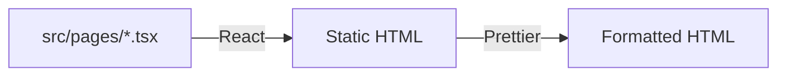

# 01397.dev

## Description

This is the source code for my personal website, [01397.dev](https://01397.dev).

## File sources

### HTML files

HTML files are generated from `src/pages/*.tsx` files. React is used as the templating engine. The generated HTML files don't include any React or JavaScript code. The output code is formatted with Prettier.

### Static files

Copied from `public/*` files to `/dist` directory.

